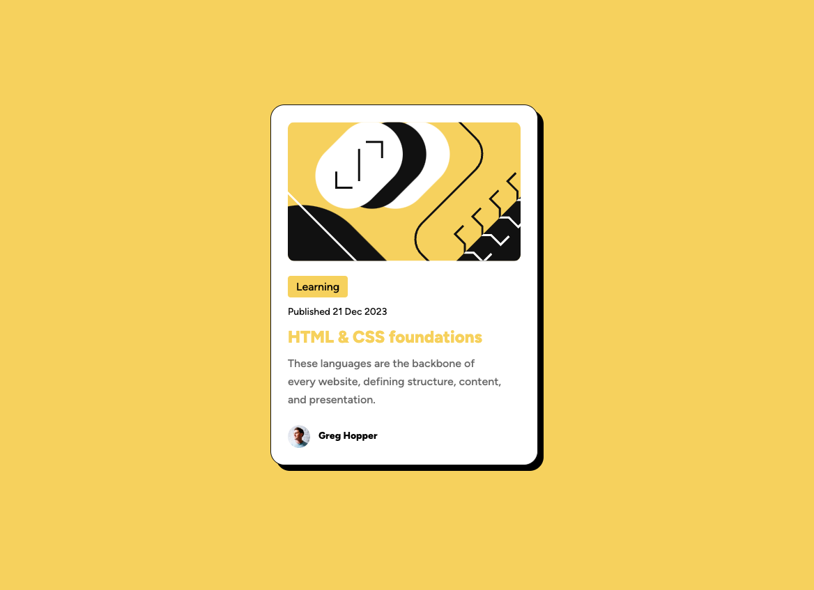

# Frontend Mentor - Blog Preview Card

This is a solution to the [Blog preview card challenge on Frontend Mentor](https://www.frontendmentor.io/challenges/blog-preview-card-ckPaj01IcS). Frontend Mentor challenges help you improve your coding skills by building realistic projects.

## Table of contents

- [Overview](#overview)
  - [Screenshot](#screenshot)
  - [Links](#links)
- [My process](#my-process)
  - [Built with](#built-with)
  - [What I learned](#what-i-learned)
  - [Continued development](#continued-development)
  - [Useful resources](#useful-resources)
- [Author](#author)
- [Acknowledgments](#acknowledgments)

## Overview

### Screenshot



### Links

- Solution Github Repo URL: [Solution repo](https://github.com/cepoumian/blog-preview-card)
- Live Site URL: [Solution live](https://cepo-blog-preview-card.netlify.app/)

## My process

### Built with

- Web Components
- Semantic HTML5 markup
- Flexbox
- CSS custom properties
- CSS Layers

### What I learned

In this mini project I wanted to focus on what I've learned from the [Every Layout](https://every-layout.dev/) CSS methodology.

The Every Layout book proposes an approach to layout based on classes or web components that tackle one specific task at a time. It also makes special emphasis on utilizing css logical properties (inline, block, etc.) instead of properties that would only work in horizontal-tb writing modes (e.g., margin-block-start instead of margin-top).

For example, the Stack has the single task of adding top margin:

```css
.stack {
  display: flex;
  flex-direction: column;
  justify-content: flex-start;
}

.stack > * {
  margin-block: 0;
}

.stack > * + * {
  margin-block-start: var(--spacing-sm);
}
```

The Cover has the task of centering its content vertically and horizontally:

```css
.cover {
  display: flex;
  flex-direction: column;
  min-block-size: 100vh;
  justify-content: center;
  align-items: center;
  padding: 1rem;
}
```

Every Layout also propses an approach to creating, using and naming utility classes that makes a lot of sese:

```html
<div class="cover bg:light">
  <div class="box container stack bg:white pb:lg">
    <figure class="figure mb:xs">
      
    </figure>
    <div class="wrapper stack">
      <h3 class="heading text:center">
        Improve your front-end skills by building projects
      </h3>
      <p class="text text:center">
        Scan the QR code to visit Frontend Mentor and take your coding skills to
        the next level
      </p>
    </div>
  </div>
</div>
```

On the other hand, I also wanted to leverage CSS layers as a way of organizing styles and managing specificity, as suggested by Kevin Powell in his (Frontend Master's course)[https://frontendmasters.com/courses/pro-css/].

```css
@layer utilities {
  .text\:center {
    text-align: center;
  }

  .bg\:light {
    background-color: var(--background-light);
  }
}
```

```css
@layer utilities {
  .text\:center {
    text-align: center;
  }

  .bg\:light {
    background-color: var(--background-light);
  }
}
```

Finally, I wanted to apply recently gained knowledge related to Web Components. I figured the "Tag" (which in this design is the yellow one that reads "Learning") would be a good opportunity to create a web component which could be potentially reused later.


The web component I ended up creating is extremely simple, and I'd still need to make it more customizable (change colors for example), but to get a grasp on the basics of web components It'd do.

```js
const template = document.createElement("template");
template.innerHTML = `
  <style>
    span {
      background-color: var(--clr-yellow);
      padding: calc(var(--spacing-xs) / 2) var(--spacing-xs);
      border-radius: calc(var(--spacing-sm) / 4);
    }
  </style>
  <span>
    <slot></slot>
  </span>
`;

class PillComponent extends HTMLElement {
  constructor() {
    super();
    this.attachShadow({ mode: "open" });
    this.shadowRoot.appendChild(template.content.cloneNode(true));
  }
}

customElements.define("pill-c", PillComponent);
```

### Useful resources

- [Web Components Book](https://coryrylan.gumroad.com/l/web-component-essentials?layout=profile) - One valuable resource I'm using to learn about web components.

- [Every Layout](https://www.example.com) - This is, by far, one of the most valuable resources on CSS and web layout I've found. Highly recomended.

- [Kevin Powell's Frontend Master's course](https://frontendmasters.com/courses/pro-css/) - One of CSS's greatest educators.

## Author

- Website - [Cesar Poumian](https://github.com/cepoumian)
- Frontend Mentor - [@cepoumian](https://www.frontendmentor.io/profile/cepoumian)
